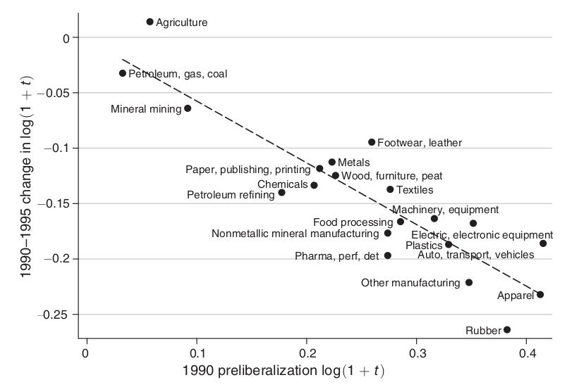

```{r setup, include=FALSE, message=FALSE, warning=FALSE}
knitr::opts_chunk$set(echo = FALSE)
# tex_output <- knitr::is_latex_output()
# stg_type <- ifelse(tex_output, 'latex', 'html')

# library(data.table)
library(tidyverse)
library(kableExtra)
library(fixest)
# library(grf)
# library(stargazer)
# library(texreg)
load("input/homework_II.RData")
```

# Part I

1. (10 points) Describe the conditions in which the differences-in-differences (DID) and the synthetic control (SC) estimators are valid. What are the main conditions in which these estimators are consistent/unbiased/asymptotically
unbiased?

DID:

Suppose we are in the simplest DID setup possible, units are separated in two states, $S_i\in\{0, 1\}$ and observed in two periods of time, $T_t\in \{0, 1\}$ and we also observe an outcome variable, $y_{it}$. We have the following potential outcomes model, with homogeneous treatment effect, $\beta$:

$$
\begin{cases}
y_{it}(0)=\alpha_0+S_i+T_t+\eta_{it}\\
y_{it}(1)=\beta+y_{it}(0)
\end{cases}
$$

This implies the following DID regression equation:


\begin{equation}
y_{it}=\alpha_0+S_i+T_t+\beta D_{it}+\eta_{it}
(\#eq:did)
\end{equation}

where $D_{it}\in\{0,1\}$ indicates the treatment status. If we let the treatment occur only at time $t=1$ for state $s=1$, then $D_{it}$ is the interaction of $S_i$ and $T_t$.

Equation regression above is a two-way fixed effect model and represents basic difference-in-difference model. The causal parameter of interest is $\beta$ and it corresponds to the double difference of $E[y_{i1}(1)-y_{i0}(1)|D=1]-E[y_{i1}(0)-y_{i0}(0)|D=0]$, thus, the estimator's name.

The causal parameter $\beta$ is identified under the assumption that **potential outcome trends would be the same** in both control and treatment groups, in the absence of treatment. It's the treatment that induces a deviation from this common (or parallel) trend.

This means that treatment assignment must be independent of potential outcomes, specifically, $E[D_{it}\eta_{it'}]=0$ for all $t$ and $t'$. **Treatment should not be chosen in response** to knowledge about how the outcome is likely to be and also that **outcome should not change in anticipation of treatment**.

SC:
 

2. (10 points) Describe settings in which the conditions above would be invalid.

The treatment exogeneity may easily be violated in a DID setup, take for example @Chay2005 who consider a policy in Chile where poorly performing schools were given additional financial resources. The DID estimator compares average school outcomes between treated and control schools before and after the subsidy. It's easy to imagine that due to chance, an above threshold school had a poor performance exactly in the pre-treatment year, inducing this school to the treatment group. After receiving treatment, and suppose the true effect is negligible, the school has a normal performance above threshold as usual. In this case the DID estimator would overestimate the treatment effect in a phenomenon known as Ashenfelter's dip.

In the syntethic control framework, **blablablabla**

3. (10 points) Describe the different alternative inference methods that are available for these two estimators. Be specific about the conditions in which each inference method would be reliable.

Inference in DID estimation is typically carried out through asymptotic approximation. If available, the researcher can also make cluster robust and/or heteroskedasticity robust inference.

The synthetic control method is more problematic when it comes to inference. Up until recently there was no analytical, even asymptotic, expressions for standard errors and inference relied on non-parametric methods. **BALBABALBLALBA**

# Part II

Choose a published paper the uses a DID or SC estimator in which the dataset is available online. You can also consider a paper that uses shift-share designs, but in this case there is a risk that we will not cover that in class. Once you decide on your paper, sign up at this link. It must be a different paper for each student.

1. (10 points) Briefly summarize the research question in the paper, and why it is interesting. What is the main parameter of interest?

The chosen paper is @Kovak2013 which studies the impact of brazillian trade liberalization in the 1990s mainly under Collor government, to regional wages. The empirical strategy is designed as a shift-share experiment, since import tariffs are set at national level but its impact on local labor markets is dependent on the industries' share of labor demand.

How trade liberalization impacts economic growth has always been a relevant and debatable question, more recently the focus has passed to liberalization and inequality. Specially for developing countries, the literature finds that trade liberalization may result in increase of wage inequality, [@Goldberg2007].

@Kovak2013 follows a growing literature by examining the effects of trade liberalization on labor market outcomes at the subnational level. The author develops a theoretical specific-factors model of regional economies to back the literature's practice of measuring the local effect of
liberalization using a weighted average of changes in trade policy, with weights
based on the industrial distribution of labor in each region.

The main parameter of interest is the regional effect of trade liberalization on real wages. This is captured by the sensitivity of regional change of log-wages from 1990 to 1995 (the period considered so the liberalization run its course) to a measure of regional change in trade policy. The author calls this measure as the region-level tariff change -- RTC -- and it is described in the next question.

The empirical results confirm the model’s predictions. Local labor markets whose
workers were concentrated in industries facing the largest tariff cuts were generally affected more negatively.

2. (10 points) Briefly describe the empirical setting.

The shift-share "treatment" considered in the paper is the region-level tariff change (RTC) for each brazilian microregion computed as follows:

\begin{align}
RTC_r=&\sum_{i\neq N}\beta_{ri}d\ln(1+\tau_i)
(\#eq:rtc)\\
\text{where}\quad &\beta_{ri}=\frac{\lambda_{ri}1/\theta_i}{\sum_{i'\neq N}\lambda_{ri'}1/\theta_{i'}}
\end{align}

where $r$ denotes a brazilian microregion and $i$ an industry. Liberalization induced price changes from 1990 to 1995 is measured as $d\ln(1+\tau_i)$, where $\tau_i$ is the tariff rate. Parameter $\lambda_{ri}$ is the fraction of regional labor allocated to industry $i$ and $\theta_i$ is the cost share of industry-specific factor.

Therefore, the main specification for the empirical analysis of log-variation in wages to a liberalization shock is:

\begin{equation}
d\ln(w_r)=\zeta_0+\zeta_1RTC_r+\varepsilon_r
(\#eq:logwage)
\end{equation}

and the main parameter of interest is the regional effect of liberalization on real wages, $\zeta_1$.

Wage and employment data come from the brazilian demographic censuses (Censo Demográfico) for 1991 and 2000. Local labor markets were defined by microregions. Wages are calculated as earnings divided by hours for individuals aged 18-55 who are not enrolled in school. Industry classification comes from the Applied Economics Research Institute (IPEA), while @Kume2003 report nominal tariff change by industry during the liberalization.

The parameters for the fraction of regional labor allocated to an industry and industry-specific factor cost share are computed from 1991 census, taking into account individual level observations and adjusting wages by a Mincer-type estimation.

3. (10 points) Discuss whether the conditions for validity of the empirical method are reasonable.

The main identification assumption in regression \@ref(eq:logwage) is the strict exogeneity of the trade liberalization shock with respect to the industry performance. The analysis utilizes variation in tariff changes across industries to compose the regressor $RTC_r$. If the tariff reduction is correlated to industry performance, then one cannot argue the regressor in equation \@ref(eq:logwage) is independent from unobservable factors that also affect the variation in log-wages, hence, unconfoundedness does not hold and a causal interpretation of $\zeta_1$ is undue.

The author is aware of this assumption and dedicates a whole section to analyze why exogeneity is likely to hold. He qualitatively argues that the driving force of Brazil's liberalization came from government, not the private sector which had little to no influence on the process. A more striking support for exogeneity comes from the data on tariff cuts by industries. Industries most protect have experienced the largest cuts, showing that the primary goal of brazillian government was to reduce tariffs in general and making the cross-industry variation as least as possible considering external incentives.

Although the author makes a compelling case for exogeneity, it is not unrealistic to imagine some sort of industry lobbying during (the short, granted) reform discussion in Congress, for example. If that is the case, some industries may end up being relatively protected after the liberalization and this can be seen in Figure 1 from @Kovak2013 and shown bellow in figure \@ref(fig:fig1), where Agriculture; Footware, leather and Electric, electronic equipment; did not suffer a large reduction in tariff as expected by their preliberalization tariff level.

```{r fig1, fig.cap="Relationship between tariff changes and preliberalization tariff levels. Kovak (2013) Figure 1."}

```

Concern with the correct estimation of $\zeta_1$ is raised when the baseline data for employment and wages is contaminated with the "treatment". Ideally, wage and employment information to compose the baseline (the $RTC_r$ indeed) should come from just before liberalization began in March 1990. Although, the use 1991 census as the baseline period relies on the assumption that wages and employment shares adjusted slowly to the trade liberalization. The trade liberalization process itself is not a sharp, one-off event, and took place during almost half a decade. This opens the possibility that workers adapted during the period, for example getting qualification and changing employment to better paid jobs just before the 1991 census, thus changing the composition of labor share in a microregion **after** the shock has begun. This fact should create an attenuation bias.

Another source of attenuation bias is interregional mobility in response to liberalization, which will smooth out the regional wage variation that would have been observed on impact. Suppose the case of instant worker mobility, all liberalization-induced wage variation would be
immediately arbitraged away by worker migration. The author raises this potential problem, since the theoretical model predicts an increase in labor supply for regions facing increased wages, but do not demonstrate data that backs his assumption of negligible migration.

The baseline contamination and interregional labor migration may provoke **attenuation bias**, that is, $\zeta_1$ will tend towards zero. This kind of bias is not so restrictive in the present paper since if causal effect is statistically significant (and the author does get effect!) then the true effect would be even larger, hence, there would be no doubt over the findings (supposing the inference is correctly done, of course).

4. (10 points) Describe how the authors conducted inference. Discuss whether the conditions for validity of the inference method are reasonable.

Inference is carried out using cluster-robust variance estimation (CRVE) obtained from asymptotic theory. The unity of observation is microregion and those are clustered into states. The regression analysis counts with 493 observations clustered at 27 states. The number of clusters is borderline to what we expect to have reasonable asymptotic approximation, since CRVE valid when we have independence across clusters and the number of them grows in tandem with number of observations, thus $N_c\rightarrow\infty$.

In the next question I will perform the assessment proposed in @Ferman2019 to have an indication whether the approximation is reliable or not. After the assessment, other inference methods will be carried and compared to the paper's original one, like wild bootstrap, permutation test and standard error computation as in @Adao2019.

5. (30 points) Use the data from the paper to re-analyze the results of the paper. You can, for example, check whether the results are robust to alternative specifications or alternative approaches for inference, you can
provide some evidence that the assumptions the authors rely on are reasonable or unreasonable, you can check whether the inference method the authors are using is reliable, and so on. Be creative!

First let's replicate the author's main results table:

```{r etable-setup}
#' Setup fixest
setFixest_se(no_FE = "hetero")
setFixest_dof(dof(fixef.K = "full")) # get Stata's reg results

#' Dicionário para o nome das variáveis nas tabelas
fixest::setFixest_dict(c(rtc_main = "Regional tariff change", 
                         rtc_notheta = "Regional tariff change", 
                         rtc_nt = "Regional tariff change",
                         state = "State",
                         dlnwmmc_mincer = "log-variation in wage",
                         dlnwmmc_mincer_nt = "log-variation in wage"))
#' Ajusta o estilo das tabelas
# est_style = list(depvar = "title:Dep. Var.",
#                  model = "title:Modelo",
#                  var = "title:\\emph{Variáveis}",
#                  stats = "title:\\emph{Estatísticas de diagnóstico}",
#                  notes = "title:\\emph{\\medskip Notas:}")
```

```{r table1, results='asis'}
nt_checks <- c(rep(TRUE, 4), rep(FALSE, 2), rep(TRUE, 2))
labor_checks <- c(rep(TRUE, 2), rep(FALSE, 2), rep(TRUE, 4))
etable(tex = TRUE,
       reg_main, reg_main_fe, reg_nolab, reg_nolab_fe, reg_notrad, 
       reg_notrad_fe, reg_workers, reg_workers_fe,
       cluster = "state",
       digits = 3,
       title = "The effect of liberalization on local wages",
       drop = "(Intercept)",
       yesNo = "$\\checkmark$",
       subtitles = c("Main", "Main", "No labor", "No labor",
                     "Nontraded", "Nontraded", "Workers", "Workers"),
       extraline = list("Nontraded sector Omited" = nt_checks,
                        "Zero price change" = !nt_checks,
                        "Labor share adjustment" = labor_checks))
```

@Ferman2019 simple inference assessment

```{r ferman, resutls='asis'}
kbl(assessment_tbl, digits = 3, booktabs = TRUE,
    caption = "Simple assessment on original inference method",
    col.names = c("Name", "$\\alpha = 0.05$", "$\\alpha = 0.10$"),
    row.names = TRUE,
    escape = FALSE) %>% 
  kable_classic(full_width = FALSE)
```

```{r inferences, results='asis'}
kbl(inferences_df, digits = 4, booktabs = TRUE,
    caption = "Alternative methods for inference. p-values.",
    col.names = c("Name", "Unstud. p-value", 
                  "Stud. p-value", "p-value",
                  colnames(adao_df)[-1]),
    row.names = TRUE,
    escape = FALSE) %>% 
  kable_classic(full_width = FALSE) %>% 
  kable_styling(font_size = 9) %>% 
  add_header_above(c(" " = 2, "Wild Bootstrap" = 2, "RI" = 1, "Adao et. al." = 5))
```

\newpage
### Annex A - R Code for homework_II.R

```{r annex-a, code=readLines("homework_II.R"), eval = FALSE, echo=TRUE}

```

\newpage
### Annex B - R Code for homework_II_census.R

```{r annex-b, code=readLines("homework_II_census.R"), eval = FALSE, echo=TRUE}

```

## References